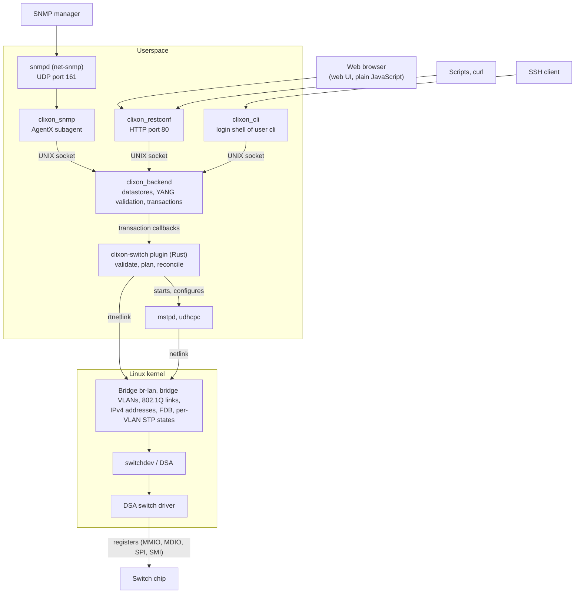
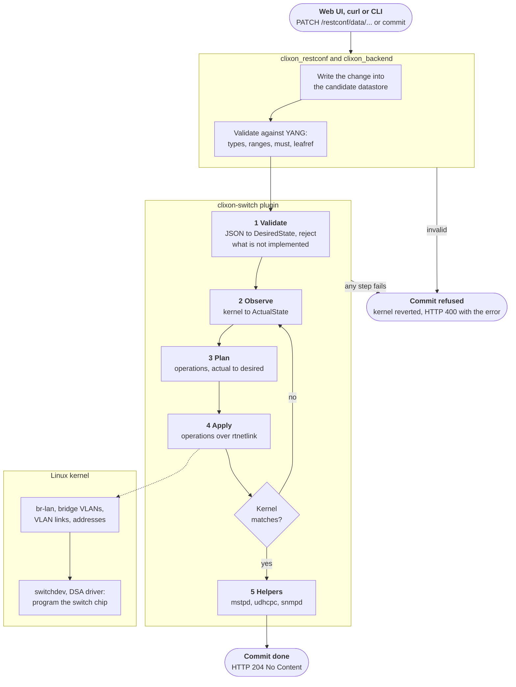

# Firmware architecture

This page is for developers who want to understand how Ethernet Switch OS
works before they change it. It follows a configuration change from the user
down to the switch chip, and shows where each part lives in the source.

## The idea in one paragraph

The switch is a small Linux computer whose network ports happen to be
connected to a switch chip. Linux sees every front port as an ordinary
network interface (`lan1`, `lan2`, ...), and the switch is configured the
way any Linux bridge is configured: a VLAN-aware bridge, bridge VLAN
entries, VLAN interfaces with IP addresses. The kernel's **switchdev** and
**DSA** frameworks pass that configuration on to the switch chip, which then
forwards frames in hardware. On top sits [clixon](https://www.clicon.org/),
which turns a YANG configuration into those kernel settings through a
backend plugin. There is **no switch ASIC SDK and no proprietary driver**
anywhere in the firmware.

## Overview

| Layer | What it is | Source |
|---|---|---|
| Web UI | Static HTML, CSS and JavaScript, no build step. Talks to the switch only through RESTCONF. | [meta-ethernet-switch-os](https://github.com/AlbrechtL/meta-ethernet-switch-os) `recipes-webui/` |
| RESTCONF | `clixon_restconf`, clixon's native HTTP/1 server. Also serves the web UI's files at `/`. | clixon, recipe in meta-ethernet-switch-os `recipes-clixon/` |
| CLI | `clixon_cli`, generated from the YANG models (clixon's autocli). It is the login shell of the user `cli`. | clixon; CLI spec in [clixon-switch-rs](https://github.com/AlbrechtL/clixon-switch-rs) `clixon/` |
| SNMP | net-snmp's `snmpd` and `clixon_snmp` as its AgentX subagent. Read-only. | net-snmp, clixon |
| Configuration backend | `clixon_backend`: holds the datastores, validates against YANG, runs transactions, loads the plugin. | clixon |
| Backend plugin | `clixon-switch`, a Rust shared library. Validates each commit and brings the kernel in line with it. | [clixon-switch-rs](https://github.com/AlbrechtL/clixon-switch-rs) |
| Linux networking | Bridge, VLANs, addresses, spanning tree states. Configured over rtnetlink. | Linux kernel |
| Hardware offload | switchdev and DSA, and the switch chip's DSA driver. | Linux kernel, BSP layer |

## Hardware support: switchdev and DSA

### No SDK, no proprietary driver

Commercial switch firmware usually drives the switch chip through the chip
vendor's SDK: a large, closed or restrictively licensed library that
programs the chip from userspace, next to (or instead of) the Linux network
stack. Ethernet Switch OS does not do that. It relies only on two Linux
kernel frameworks:

- **[switchdev](https://docs.kernel.org/networking/switchdev.html)** is the
  kernel's generic interface for offloading bridge and VLAN configuration to
  hardware. When the bridge adds a VLAN to a port, learns an address or
  changes a port's spanning tree state, switchdev hands the change to the
  driver, which programs the chip.
- **[DSA](https://docs.kernel.org/networking/dsa/dsa.html)** (Distributed
  Switch Architecture) is the switchdev framework for switch chips that
  hang off an Ethernet interface of the CPU. That interface is the
  *conduit* (`eth0`); every front port becomes a *user port*, a network
  interface of its own (`lan1` ... `lanN`). Frames between the CPU and the
  chip carry a small tag that says which port they belong to.

So the firmware never talks to the switch chip directly. The plugin
configures a normal Linux bridge, and the kernel driver decides what the
hardware does with it. The same userspace binary runs on every board.

### Which switches can be supported

In principle, **every switch chip that has a switchdev or DSA driver in the
Linux kernel** can run Ethernet Switch OS. The mainline kernel has DSA
drivers for many chips, for example Marvell (`mv88e6xxx`), Broadcom
(`b53`), MediaTek (`mt7530`), Microchip (`ksz`, `lan9303`), NXP (`sja1105`,
`felix`), Qualcomm (`qca8k`) and Realtek (`rtl8365mb`, `rtl8366rb`), and
switchdev drivers for larger chips such as Marvell Prestera, Mellanox
Spectrum (`mlxsw`) and Microchip Sparx5 and LAN966x. OpenWrt maintains more
out-of-tree drivers, like the one for the Realtek RTL83xx family used here.

"In principle", because the driver has to do more than create the ports.
What the firmware expects from it:

| Feature | Needed for | Without it |
|---|---|---|
| Bridge offload (`port_bridge_join`/`leave`) | Forwarding in hardware | Every frame between two ports goes through the CPU. |
| VLAN filtering offload (`port_vlan_add`/`del`) | VLANs, 802.1Q access and trunk ports | VLANs are forwarded in software only, if at all. |
| FDB offload | Address learning and aging in hardware; the forwarding database in SNMP | Flooding or software forwarding. |
| Port STP state (`port_stp_state_set`) | STP and RSTP | Spanning tree cannot block ports in hardware. |
| MST offload (`vlan_msti_set`, `port_mst_state_set`) | MSTP with several instances | Only the CIST is possible. |

The [Linux DSA Feature List Explorer](https://linux-dsa-list.albrechtloh.de/)
shows which DSA driver supports which of these features, and which chips
each driver covers.

The Raspberry Pi switch shows why this matters: the mainline `rtl8365mb`
driver in Linux 6.18 only creates the ports. Without the bridge, VLAN and
FDB offload that the BSP backports from newer kernels, every frame between
two front ports crosses the ENC28J60 SPI link at about 5 Mbit/s.

A new switch therefore needs a BSP layer with a kernel whose driver has
these features, and a device tree that names the front ports `lan1`,
`lan2`, ... See [Bringing up new hardware](#bringing-up-new-hardware).

### The current boards

| Board | Switch chip | Kernel driver | CPU connection |
|---|---|---|---|
| Zyxel GS1900-8, RTL8382MI test switch | Realtek RTL8380M / RTL8382M (switch and MIPS CPU in one SoC) | `rtl83xx` DSA driver and `rtl838x_eth` from OpenWrt, patched into Linux 6.18 by meta-rtl83xx-bsp | internal |
| Raspberry Pi 4-port managed switch HAT | Realtek RTL8367S | mainline `rtl8365mb` DSA driver, managed over bit-banged SMI, plus OpenWrt's backports for bridge, VLAN and FDB offload | ENC28J60 on SPI as conduit |
| QEMU x86-64 switch | none | none: the eight virtio-net ports are plain interfaces, the bridge forwards in software | — |

The QEMU switch is the proof that the plugin does not depend on DSA: it
treats DSA user ports as switch ports by default, and
`CLIXON_SWITCH_PORTS="lan1 ... lan8"` in `/etc/default/clixon-backend`
names other interfaces instead. The same mechanism would serve a pure
switchdev driver whose ports are not DSA ports.

## Minimum hardware

The firmware is built for small switches with at least **16 MB of flash**
and **128 MB of RAM**. Every component is chosen with that in mind: musl
and busybox instead of glibc and systemd, a compressed read-only root
filesystem, and no services beyond the ones listed on this page.

The numbers below are those of the Zyxel GS1900-8, with Linux 6.18.48.

### Flash

The 16 MiB SPI-NOR flash is divided into five partitions:

| Partition | Size | Content |
|---|---|---|
| `u-boot` | 256 KiB | The stock Zyxel bootloader. Never written. |
| `u-boot-env` | 64 KiB | Bootloader environment |
| `u-boot-env2` | 64 KiB | Second bootloader environment (`bootpartition`) |
| `data` | 2 MiB | JFFS2, the writable layer on top of the root filesystem: the saved configuration, SSH host keys. Kept across firmware updates. |
| `firmware` | 13.6 MiB | The firmware itself, see below. Rewritten by a firmware update. |
| **Total** | **16 MiB** | |

The firmware in the `firmware` partition:

| Part | Size |
|---|---|
| Kernel with device tree (uImage, padded to 64 KiB) | 2.2 MiB |
| Root filesystem (squashfs, xz compressed) | 5.4 MiB |
| **Used** | **7.6 MiB** |
| Free | 6.0 MiB |

A firmware update file (`.swu`) is the content of the `firmware` partition,
so it has the same size.

### RAM

Of the 128 MiB, the kernel keeps about 8 MiB for itself (its code and data,
and the table that describes every page of memory) and reports 119.6 MiB
as usable. Right after boot, `free` shows:

| | Size | What it is |
|---|---|---|
| Used | 30.9 MiB | Kernel allocations and all processes |
| Buffers and cache | 22.9 MiB | Mostly pages of the root filesystem, already decompressed |
| Available | 64.5 MiB | What new processes can get, including cache that can be dropped |

Normal operation needs only about 31 MiB. The minimum is set by the moments
when much more is needed at once:

- **Firmware update.** There is only one firmware slot, so SWUpdate must
  receive the whole update file and check its SHA-256 hash *before* it
  erases the `firmware` partition. The file is kept in `/tmp`, which is
  RAM: 7.6 MiB. SWUpdate, its libraries and its web page are also copied to
  RAM first, because the update overwrites the squashfs they would
  otherwise be loaded from.
- **First install and recovery.** The TFTP boot image runs the whole system
  from RAM: its root filesystem unpacks to 19.0 MiB, and the factory
  update file it then receives is another 9.6 MiB in `/tmp`, on top of the
  same services as in normal operation.
- **Features and logins.** Spanning tree (`mstpd`), SNMP (`snmpd`,
  `clixon_snmp`) and the DHCP client run only when configured, and every SSH
  login to the CLI starts another `clixon_cli`. Every clixon process loads
  the YANG models into memory, and the OpenConfig models are large.
- **Cache.** The programs run from a xz-compressed squashfs. When memory
  gets short, the kernel drops their pages from the cache and has to read
  and decompress them again from flash the next time they are used, which
  is slow on this CPU.

With **64 MiB**, about 56 MiB would be usable. The first install alone
needs roughly 19 + 9.6 + 31 = 60 MiB, so it does not fit. In normal operation
about 25 MiB would remain for the cache, the optional services, CLI
sessions and a firmware update, which is not enough headroom for all of
them.

## What happens on a configuration change

A change is a clixon transaction, for example a RESTCONF request that puts
`lan3` into VLAN 20. The CLI's `commit` and the web UI take the same path.
The numbered steps are explained below the diagram.

The steps in the plugin:

1. **Validate.** `switch-model` parses the target configuration, which
   clixon passes as RFC 7951 JSON, into a `DesiredState`. It checks what
   YANG cannot express (a port's VLANs must be declared, only one DHCP
   client, 802.1D timer rules, ...) and **rejects everything the firmware
   does not implement**, such as MTU, IPv6 or subinterfaces. The data
   models describe much more than the switch can do, and a setting that
   is stored but has no effect would be a lie.
2. **Observe.** `switch-net` reads the kernel's current state over
   rtnetlink into an `ActualState`: links and their kinds, bridge
   membership, bridge VLAN entries, addresses.
3. **Plan.** A pure function computes the list of operations from the
   actual to the desired state, in an order the kernel accepts and without
   interrupting traffic: a port's new PVID is added before its old one is
   removed, a new management address before the old one goes.
4. **Apply and repeat.** The operations are sent over rtnetlink, then the
   plugin observes again, until the kernel matches. Some operations have
   side effects that are easier to observe than to predict.
5. **Helpers.** The plugin starts, reconfigures or stops `mstpd` (spanning
   tree), `udhcpc` (DHCP client) and `snmpd` with `clixon_snmp`, as the
   configuration asks for them. They are children of `clixon_backend`.

If the commit fails, clixon calls `trans_revert`, and the plugin reconciles
the kernel back to the previous configuration the same way.

The plugin is **declarative**: it does not translate a diff into commands
but always brings the whole kernel state it owns (the bridge `br-lan`, the
switch ports and the VLAN interfaces on the bridge) in line with the whole
configuration. Anything else in the kernel is left alone. The mapping from
configuration to kernel objects is in the
[clixon-switch-rs README](https://github.com/AlbrechtL/clixon-switch-rs#kernel-mapping).

**State data** (counters, link state, DHCP lease, spanning tree roles,
firmware version) takes the reverse path: clixon calls the plugin's
`statedata` callback, which reads the kernel over netlink, asks mstpd with
`mstpctl`, and reads `/proc`.

## Data model

The configuration is described by YANG. It uses OpenConfig where OpenConfig
has a model (`openconfig-interfaces`, `openconfig-vlan`,
`openconfig-if-ip`, `openconfig-spanning-tree`), `ietf-snmp` for SNMP, and
the project's own module `clixon-switch` for what neither covers: the VLAN
database, port-based VLANs, the MSTP CIST, system contact and location, and
state such as the DHCP lease and `/system/state`. The MIBs served over SNMP
are translated to YANG as well, so `clixon_snmp` can serve them from the
same backend.

All YANG files are in `yang/` of clixon-switch-rs; `yang/vendor/` holds
the imported OpenConfig and IETF modules. What the switch accepts is listed
under [YANG models](../yang-models.md).

## Datastores and persistence

clixon keeps the configuration in XML datastores:

| Datastore | Where | Content |
|---|---|---|
| `candidate_db` | `/var/run/clixon-switch/` (RAM) | The CLI's working copy until `commit`. |
| `running_db` | `/var/run/clixon-switch/` (RAM) | The active configuration. |
| `startup_db` | link to `/var/lib/clixon/clixon-switch/startup_db` (flash) | The saved configuration, loaded at boot. Kept across firmware updates. |
| `failsafe_db` | `/var/run/clixon-switch/` (RAM) | The factory default. clixon falls back to it when `startup_db` does not commit. |

A commit changes `running` only. `save` in the CLI, "Save configuration" in
the web UI or a RESTCONF `copy-config` from running to startup makes it
permanent. Only `startup_db` is on flash, because clixon rewrites the other
datastores on every edit. Deleting `startup_db` is a factory reset.

## Boot sequence

1. The bootloader (the stock U-Boot on the RTL83xx boards, U-Boot on the
   Raspberry Pi, EFI Boot Guard on QEMU) loads the kernel.
2. The kernel probes the switch driver, which creates the conduit and the
   front ports `lan1` ... `lanN`, named by the device tree.
3. An overlay init script mounts the read-only squashfs root with the
   writable `data` partition on top (JFFS2 on the RTL83xx flash, ext4 on the
   SD card and the QEMU disk).
4. busybox `init` runs the SysV init scripts:
    - `clixon-backend` runs `prepare-datastore` (creates `startup_db` from
      the factory default on the first boot) and starts `clixon_backend`.
      The backend commits `startup_db` through the plugin, which creates
      `br-lan`, adds the ports and puts the management address on `vlan1`.
      **There is no other network configuration**: no
      `/etc/network/interfaces`, no NetworkManager.
    - `clixon-restconf` starts `clixon_restconf` on port 80.
    - `dropbear` (SSH) and `swupdate` (firmware update, port 8080).

## Processes at runtime

| Process | Started by | Port / socket | Role |
|---|---|---|---|
| `clixon_backend` | init script | `/var/run/clixon-switch.sock` | Configuration, with the plugin loaded |
| `clixon_restconf` | init script | TCP 80 | RESTCONF and the web UI files |
| `clixon_cli` | SSH login of `cli` | — | CLI |
| `dropbear` | init script | TCP 22 | SSH |
| `swupdate` | init script | TCP 8080 | Firmware update and its web page |
| `mstpd` | plugin, while spanning tree is enabled | — | STP, RSTP, MSTP |
| `udhcpc` | plugin, while a DHCP client is configured | — | DHCP client |
| `snmpd`, `clixon_snmp` | plugin, while SNMP is enabled | UDP 161, AgentX socket | SNMPv3 agent |

## Operating system base

- Built with the **Yocto Project** (openembedded-core, branch *wrynose*),
  distro `ethernet-switch-os`, based on `poky-tiny`: **musl** libc,
  **busybox** as init, shell and device manager (`mdev`). No systemd, udev
  or D-Bus. Flash is the constraint: the GS1900-8 has 16 MiB of SPI-NOR for
  everything.
- **Linux 6.18** on all current boards.
- Root filesystem: read-only **squashfs**, with an overlay on the `data`
  partition for everything that is written (the saved configuration, SSH
  host keys).
- **SWUpdate** installs `.swu` update files: in place on the RTL83xx boards
  (one firmware slot), A/B with rollback on the Raspberry Pi and QEMU. See
  [Firmware update](../maintenance.md#firmware-update).
- **Rust** for the plugin, cross-compiled by Yocto. On the RTL83xx boards
  that is `mips32r2` big endian with musl, a tier 3 Rust target.

## Where the code is

| Repository | Content |
|---|---|
| [ethernet-switch-os](https://github.com/AlbrechtL/ethernet-switch-os) | kas files per board, CI, QEMU scripts, this documentation |
| [meta-ethernet-switch-os](https://github.com/AlbrechtL/meta-ethernet-switch-os) | The distro: clixon and cligen recipes (with patches), the `clixon-switch` recipe, init scripts, the web UI, SWUpdate integration, mstpd and net-snmp adjustments. Reaches into each BSP through `dynamic-layers/`. |
| [clixon-switch-rs](https://github.com/AlbrechtL/clixon-switch-rs) | The backend plugin, the YANG models, the CLI spec, `clixon.xml`, the factory default |
| [meta-rtl83xx-bsp](https://github.com/AlbrechtL/meta-rtl83xx-bsp) | Realtek RTL83xx: kernel with the OpenWrt drivers, device trees, boot image, flash layout, rtl838x-qemu recipe |
| [meta-rpi-managed-switch-bsp](https://github.com/AlbrechtL/meta-rpi-managed-switch-bsp) | Raspberry Pi switch HAT: kernel configuration and backports, device tree overlay, SD card layout, A/B update |
| [meta-qemu-switch-bsp](https://github.com/AlbrechtL/meta-qemu-switch-bsp) | QEMU x86-64 switch: machine, disk layout, EFI Boot Guard |
| [rtl838x-qemu](https://github.com/AlbrechtL/rtl838x-qemu) | QEMU models of the RTL838x SoC, for testing the real GS1900-8 image |

The BSP layers are hardware only and boot to a shell without the distro
layer. The distro layer does not depend on any BSP. See
[Layers and kas files](kas.md).

Inside clixon-switch-rs, the plugin is split so that most of it can be
tested on a development machine without clixon or root rights:

| Crate | Content |
|---|---|
| `switch-model` | JSON → validated `DesiredState`; state data as XML; `snmpd.conf`. Pure functions. |
| `switch-net` | `ActualState`, the planner, `reconcile`, the netlink backend, a fake kernel for tests; mstpd, udhcpc and snmpd management |
| `clixon-sys` | Declarations of the libclixon functions in use |
| `clixon-plugin` | A safe Rust interface to clixon's plugin callbacks. Panics are caught, so a bug fails the transaction instead of crashing `clixon_backend`. |
| `clixon-switch-plugin` | The shared library `clixon_backend` loads; wires the other crates together |

## Where to start

| You want to ... | Start in |
|---|---|
| Support a new setting | The YANG model if needed (`yang/`), accept it in `switch-model` (`supported.rs`, `lib.rs`), map it to the kernel in `switch-net` (`plan.rs`, `netlink.rs`). Add unit tests and a pytest integration test. The CLI and RESTCONF get it for free. |
| Change the web UI | `recipes-webui/ethernet-switch-os-webui/files/www/` in meta-ethernet-switch-os. It only uses RESTCONF. |
| Add a daemon or package | `packagegroup-ethernet-switch-os-base.bb` or the image `.bbappend`s in meta-ethernet-switch-os. Mind the flash size. |
| Try the plugin quickly | `cargo test` on the host, then `dev/container.sh` in clixon-switch-rs, which runs clixon with the plugin on dummy interfaces. See its README. |
| Test the whole firmware | The QEMU boards, see [Testing and CI](testing.md). |

### Bringing up new hardware

1. Find a Linux kernel with a DSA or switchdev driver for the switch chip
   that has the offload features listed [above](#which-switches-can-be-supported).
   The [Linux DSA Feature List Explorer](https://linux-dsa-list.albrechtloh.de/)
   lists the DSA drivers, the chips they cover and the features
   each one implements. Check OpenWrt too, for drivers not in mainline yet.
2. For a chip family the project already knows (Realtek RTL83xx), a new
   machine `.conf` and device tree in the existing BSP and a board file in
   `kas/board/` are enough, see [Adding a board](kas.md#adding-a-board).
   Otherwise write a new BSP layer, see [Adding a BSP](kas.md#adding-a-bsp).
   It has to boot to a shell on its own.
3. Name the front ports `lan1`, `lan2`, ... in the device tree. The plugin
   and SNMP derive port numbers from these names.
4. Add the board to `conf/distro/include/ethernet-switch-os-boards.inc` in
   meta-ethernet-switch-os: its front ports for the factory default, and
   its hardware revision for SWUpdate.
5. Add `.swu` recipes for the board's flash layout under
   `dynamic-layers/<bsp>/` in meta-ethernet-switch-os.

No change to the plugin is needed, unless the driver behaves differently
from the ones above.
