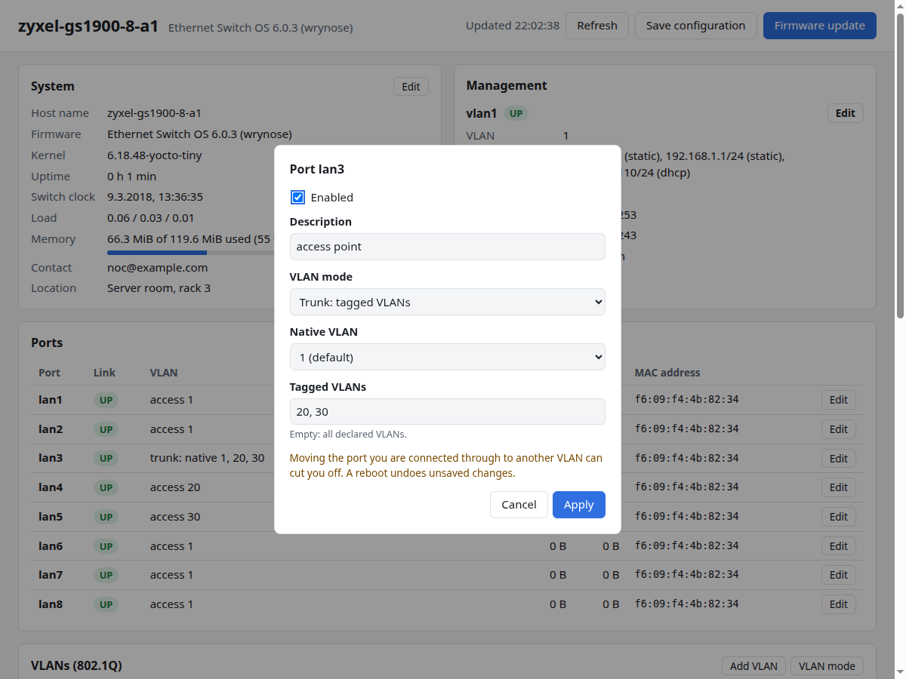

# Ports

The switch ports are named after the labels on the front: `lan1` … `lan8`
on the Zyxel GS1900-8. In the configuration they are interfaces of type
`ianaift:ethernetCsmacd`. By factory default all ports are enabled.

What a port does with VLANs is described in [VLANs](vlans.md). This page
covers the other port settings:

- **Enabled.** A disabled port has its link down.
- **Description.** A free-text label, for example what is connected.
- **Removed from the configuration.** A port that is not in the
  configuration at all is taken out of the bridge and switched off. This is
  an alternative to disabling an unused port. Only real ports can be added
  back; other names are rejected with
  `interface lan9: not a port of this switch (ports: lan1, lan2, lan3, lan4, lan5, lan6, lan7, lan8)`.

Every port auto-negotiates speed and duplex.

The port status:

| Field | Name in the data model | Meaning |
|---|---|---|
| Admin status | `admin-status` | `UP` if the port is enabled in the configuration. |
| Link | `oper-status` | `UP` when there is a link. `LOWER_LAYER_DOWN` when no cable is connected, `DOWN` when the port is disabled. |
| Counters | `counters` | Bytes (`octets`) and frames (`pkts`) received and sent since boot. |
| MAC address | `hw-mac-address` | The port's MAC address. |

## Web UI

The **Ports** card of the [status page](../getting-started/web-ui.md#status-page)
has one row per port:

| Column | Meaning |
|---|---|
| Link | `UP` with a link. `LOWER_LAYER_DOWN` or `DOWN` without. `DISABLED` if the port is switched off in the configuration. |
| VLAN | See [VLANs](vlans.md#web-ui). |
| Description | The port's description. |
| Received, Sent | Bytes since boot. |
| MAC address | The port's MAC address. |

Ports that were [removed from the configuration](#remove-a-port-from-the-configuration)
are not listed.

A port's **Edit** button changes whether it is enabled, its description,
and its [VLANs](vlans.md#web-ui).



!!! note "Not in the web UI"
    Removing a port from the configuration and adding it back is done with
    the [CLI](#cli) or [RESTCONF](#restconf).

## CLI

### Enable and disable a port

```text
switch> set interfaces interface lan6 config enabled false
switch> commit
```

`enabled true` turns it on again.

### Description

```text
switch> set interfaces interface lan5 config description "Printer, room 2"
switch> commit
```

### Port status

```text
switch> show state text interfaces interface lan1
interface lan1 {
   config {
      name lan1;
      type ianaift:ethernetCsmacd;
      enabled true;
   }
   state {
      ...
      enabled true;
      admin-status UP;
      oper-status UP;
      counters {
         in-octets 1226;
         in-pkts 11;
         out-octets 1416;
         out-pkts 11;
      }
      ...
   }
   ...
   openconfig-if-ethernet:ethernet {
      state {
         ...
         hw-mac-address a6:55:c6:1d:fa:a0;
      }
   }
}
```

The rest of the output shows the fixed values of settings the switch does
not implement (see [Not supported](#not-supported)).

To see all ports at once, use `show state text interfaces`.

### Remove a port from the configuration

```text
switch> delete interfaces interface lan7
switch> commit
```

In [port-based mode](vlans.md#port-based-vlans), also remove it from its
group in the same commit.

To bring it back, add it with all its settings:

```text
switch> set interfaces interface lan7 config name lan7
switch> set interfaces interface lan7 config type ianaift:ethernetCsmacd
switch> set interfaces interface lan7 config enabled true
switch> set interfaces interface lan7 ethernet switched-vlan config interface-mode ACCESS
switch> set interfaces interface lan7 ethernet switched-vlan config access-vlan 1
switch> commit
```

In the current firmware the `access-vlan 1` line is rejected by the CLI
(see [Known problems](../limitations.md#known-problems-in-the-current-firmware)); add the port
back over RESTCONF instead.

## RESTCONF

!!! note "Coming later"
    Examples are not written yet. See [Using RESTCONF](../getting-started/restconf.md)
    for how the CLI paths above map to RESTCONF resources.

A port is configured under:

```text
/restconf/data/openconfig-interfaces:interfaces/interface=lan1
```

## Not supported

These port settings exist in the model, and the CLI's `?` offers them, but
the switch rejects them.

| Setting | Error |
|---|---|
| `auto-negotiate false` | `ethernet/config/auto-negotiate false is not supported, only true` |
| Fixed speed or duplex (`port-speed`, `duplex-mode`) | `ethernet/config/port-speed is not supported` |
| MTU | `config/mtu is not supported` |
| Flow control | `ethernet/config/enable-flow-control true is not supported, only false` |
| Hold time, dampening | `hold-time/config/up 100 is not supported, only 0` |
| Link aggregation (`aggregate-id`, `aggregation`), subinterfaces, MAC address, FEC | rejected |
