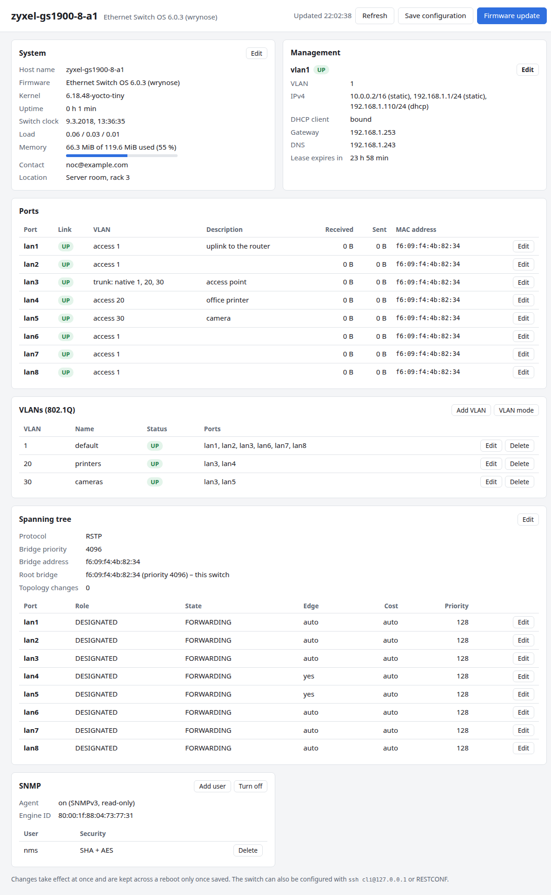
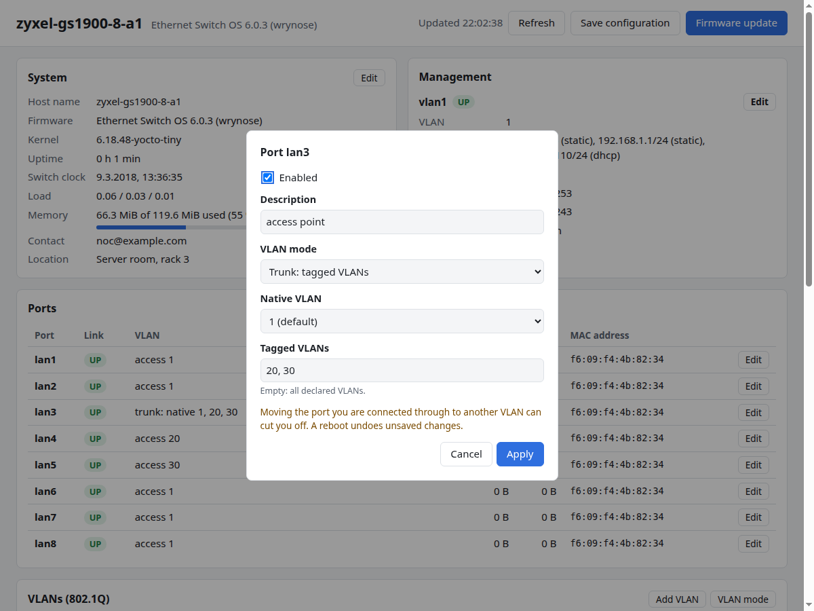
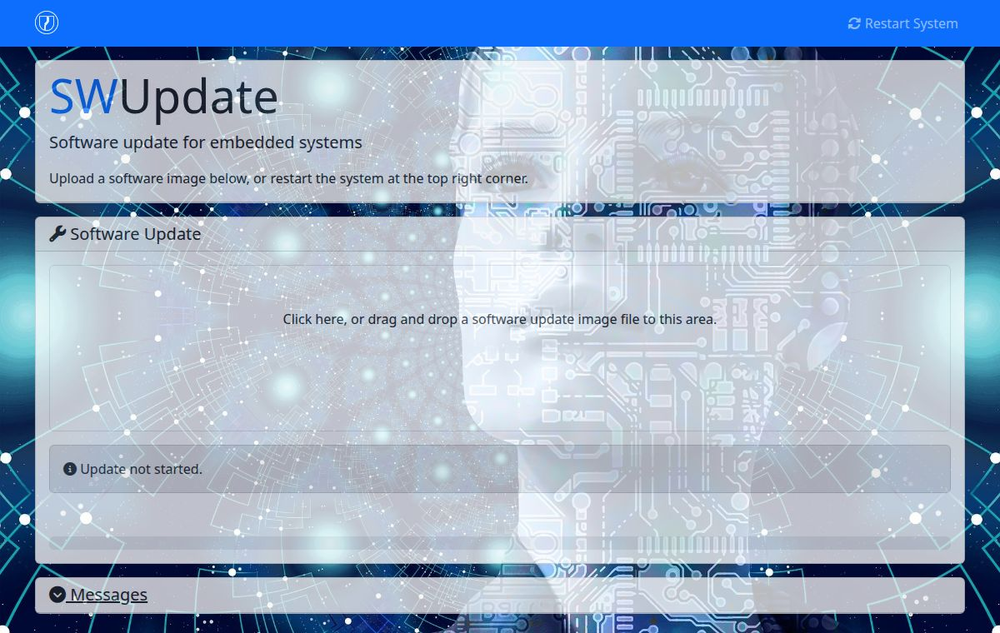

# Web UI

The switch has two web pages:

| URL | Page |
|---|---|
| `http://<switch-ip>/` | [Status page](#status-page): what the switch is doing, and its [settings](#changing-settings). |
| `http://<switch-ip>:8080/` | [Firmware update page](#firmware-update-page). |

Both work in any current browser and need no login.

!!! danger "No password"
    Anyone who can reach the switch can open both pages, change the
    configuration on the status page and install firmware through the
    update page. See
    [Limitations](limitations.md#security).

## Status page

The status page shows the state of the switch at a glance. Its **Edit**,
**Add** and **Delete** buttons change the configuration, see
[Changing settings](#changing-settings). Anything the page does not offer
is configured with the [CLI](cli/basics.md) or RESTCONF.

It updates itself every 5 seconds while it is visible. **Refresh** updates
it at once, and the time of the last update is next to it.

### Header

- The switch's host name and firmware version.
- **Save configuration** keeps the changes made since the last save across
  a reboot. It is highlighted while there are unsaved changes.
- **Firmware update** opens the [firmware update page](#firmware-update-page)
  in a new tab.

### System

| Field | Meaning |
|---|---|
| Host name | The switch's host name. |
| Firmware | Name and version of the installed firmware. |
| Kernel | Linux kernel version. |
| Uptime | Time since the last boot. |
| Switch clock | The switch's clock, in your browser's time zone. It is not synchronised and starts at the same fixed date on every boot. |
| Load | CPU load over 1, 5 and 15 minutes. |
| Memory | RAM in use. |
| Contact, Location | Who is responsible for the switch and where it is, when set. SNMP reports them as `sysContact` and `sysLocation`. |

### Management

One block per [routed VLAN interface](cli/ip.md), for example `vlan1`, with
its link state (`UP` or down):

| Field | Meaning |
|---|---|
| VLAN | The VLAN (or port-based group) the interface is in. |
| IPv4 | Its addresses, each marked `static` or `dhcp`. |
| DHCP client | `off`, `waiting for a lease`, or `bound`. |
| Gateway, DNS, Domain, Lease expires in | From the DHCP lease, when there is one. |

### Ports

One row per port:

| Column | Meaning |
|---|---|
| Link | `UP` with a link. `LOWER_LAYER_DOWN` or `DOWN` without. `DISABLED` if the port is switched off in the configuration. |
| VLAN | `access 20`, `trunk: native 1, 20, 30..40`, or `group 1 (office)` in port-based mode. |
| Description | The port's description. |
| Received, Sent | Bytes since boot. |
| MAC address | The port's MAC address. |

Ports that were [removed from the configuration](cli/interfaces.md#remove-a-port-from-the-configuration)
are not listed.

### VLANs

In 802.1Q mode, the declared VLANs with name, status (`UP` for active,
`SUSPENDED`) and the ports that carry them. In
[port-based mode](cli/vlans.md#port-based-vlans), the groups with their
names and member ports.

### Spanning tree

The protocol (`off`, `STP`, `RSTP` or `MSTP`), the switch's bridge priority
and address, the root bridge and the root port, and the number of topology
changes. Below, one row per port with its role, state (for example
`FORWARDING`), whether it is an edge port, and its path cost and priority.
See [Spanning tree](cli/spanning-tree.md).

### SNMP

Whether the SNMPv3 agent is on, the engine ID, and the SNMP users. See
[SNMP](snmp/index.md).

### When the page shows an error

"Cannot read the switch's state" means the page could not get the data
from the switch, for example while it reboots. The page keeps trying every
5 seconds and recovers by itself.

## Changing settings

An **Edit** (or **Add**, **Delete**) button opens a dialog. **Apply**
sends the change to the switch, and it takes effect at once. If the switch
refuses the change, the dialog stays open and shows why, for example
`VLAN 20 is not declared in vlans`. Nothing has changed then.

!!! warning "Save, or lose it on reboot"
    Applied changes are **not saved**. A yellow banner says so until you
    click **Save configuration**. A reboot goes back to the saved
    configuration, which is also how you recover from a change that cut
    you off.

The page does not update itself while a dialog is open.

| Where | What you can change |
|---|---|
| System | Contact and location. The host name cannot be changed. |
| Management | Per routed VLAN interface: the DHCP client, and the static IPv4 addresses, one `address/prefix-length` per line. |
| Ports | Enabled or not, the description, and in 802.1Q mode the VLANs: **Access** (untagged in one VLAN) or **Trunk** (a native VLAN and the tagged VLANs, such as `10, 20-30`; empty means all declared VLANs). |
| VLANs | Add, rename, suspend and delete VLANs. In port-based mode, add, edit and delete groups; ticking a port that is in another group moves it. **VLAN mode** switches between 802.1Q and port-based mode. |
| Spanning tree | **Edit**: the protocol or off, the bridge priority and the timers. A port's **Edit**: edge port, link type, path cost and port priority. |
| SNMP | **Add user**, **Delete** a user, **Turn on** / **Turn off** the agent. |

A few changes need care:

- **Management address.** Removing the address the page is open on cuts it
  off. The page then links to the new address, where you check that it
  works and save. If you cannot reach the switch any more, reboot it.
- **Ports and VLANs.** Moving the port your computer is connected to into
  another VLAN or group cuts you off in the same way.
- **Spanning tree.** Turning it on or changing the protocol blocks the
  ports until they are known to be loop-free: a few seconds with RSTP,
  about 30 seconds with STP. The dialog may then say that the switch did
  not answer in time; the page catches up once the ports forward again.
- **VLAN mode.** Switching removes the VLAN settings of every port. In
  port-based mode all ports go into group 1; in 802.1Q mode every port
  becomes an access port in VLAN 1. `vlan1` keeps working either way.
  The switch refuses the change while a routed VLAN interface uses another
  VLAN or group.
- **SNMP users.** You type the two passphrases (at least 8 characters each)
  in the dialog. The browser turns them into keys, and only the keys go to
  the switch, as in [SNMP](snmp/index.md#how-snmpv3-security-works-here). The
  user can read everything with `authPriv`, as user `nms` in that
  chapter. For the first user, the dialog proposes an engine ID if none is
  set; use your own if you want, and give every switch a different one.
  Deleting the last user turns the agent off.
- MSTP regions and instances, SNMP views and groups other than the one the
  page creates, and everything else not listed above are configured with
  the CLI or RESTCONF.

## Firmware update page

The update page is SWUpdate's own web interface. How to use it, and what
to watch out for, is described in
[Firmware update](maintenance.md#update-in-the-browser).
In short:

- **Software Update**: drop a `.swu` file here, or click to choose one. The
  upload and installation start at once.
- The status line below it ("Update not started", "Updated successfully",
  "Update failed") and the progress bar show how far it got.
- **Messages** (click to open) lists what SWUpdate is doing, including the
  reason when an update fails. It only shows messages of updates that run
  while the page is open.
- **Restart System** (top right) reboots the switch at once. Committed but
  unsaved configuration changes are lost.
